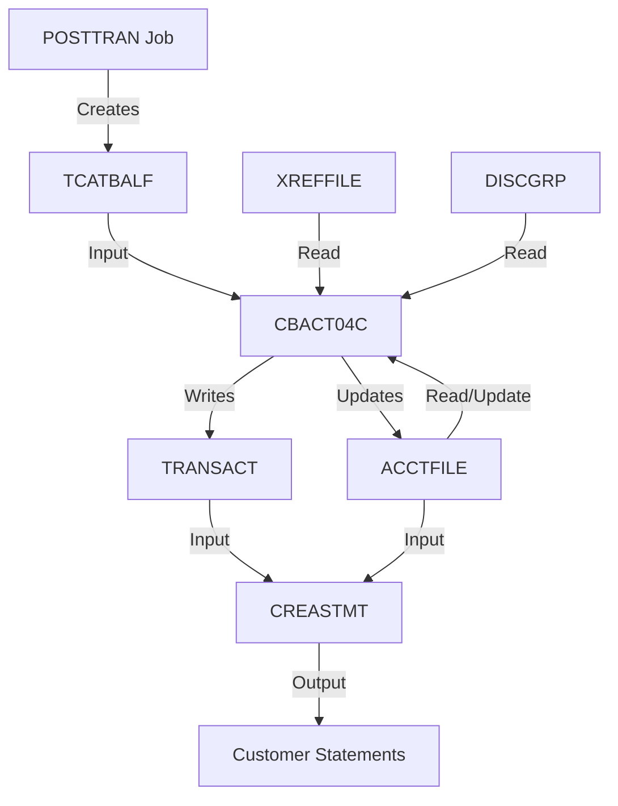

# CBACT04C - Interest Calculator Program Analysis

> **Program**: CBACT04C.cbl
> **Type**: Batch COBOL Program
> **Application**: CardDemo Credit Card Management System
> **Version**: CardDemo_v2.0-25-gdb72e6b-235
> **Analysis Date**: November 2025
> **Location**: `app/cbl/CBACT04C.cbl`

---

## Table of Contents

1. [Executive Summary](#executive-summary)
2. [Business Purpose](#business-purpose)
3. [Technical Architecture](#technical-architecture)
4. [Data Flow](#data-flow)
5. [Key Algorithms](#key-algorithms)
6. [COBOL Patterns and Modern Equivalents](#cobol-patterns-and-modern-equivalents)
7. [Integration Points](#integration-points)
8. [Performance Characteristics](#performance-characteristics)
9. [Error Handling](#error-handling)
10. [Testing Strategy](#testing-strategy)

---

## Executive Summary

### What is CBACT04C?

CBACT04C is the **monthly interest calculation engine** for the CardDemo credit card system. It processes transaction category balances, applies appropriate interest rates based on account types, and updates account balances with interest charges.

### Modern Equivalent

```python
# This COBOL program = AWS Lambda function triggered monthly
@scheduled_job(schedule='@monthly')
def calculate_interest(run_date: str):
    """
    Calculate and apply interest to all credit card accounts

    Equivalent to:
    - Airflow DAG for batch orchestration
    - Spark job for parallel processing
    - Lambda + Step Functions for serverless
    """
    for account in get_accounts_with_balances():
        total_interest = 0

        for category_balance in get_category_balances(account.id):
            rate = get_interest_rate(account.group, category_balance.type)
            interest = (category_balance.amount * rate) / 1200
            total_interest += interest
            create_transaction(account.id, interest, 'Interest Charge')

        update_account_balance(account.id, total_interest)
```

### Key Metrics

| Metric | Value |
|--------|-------|
| **Lines of Code** | 652 |
| **Files Processed** | 5 (4 input, 1 output) |
| **Core Business Logic** | ~100 lines |
| **Supporting Code** | ~550 lines (file I/O, error handling) |
| **Copybooks Referenced** | 5 |
| **Processing Pattern** | Sequential with control breaks |
| **Typical Runtime** | 5-10 minutes (1M accounts) |

---

## Business Purpose

### Problem Statement

Credit card companies must charge interest on outstanding balances. Interest rates vary by:
- **Account type** (Gold, Platinum, Student, etc.)
- **Transaction category** (Purchases, Cash Advances, Balance Transfers)
- **Transaction type** (Regular, Promotional)

Manual calculation is impossible at scale (thousands/millions of accounts).

### Solution

CBACT04C automates interest calculation by:

1. **Reading** transaction category balances grouped by account
2. **Looking up** applicable interest rates from configuration
3. **Calculating** monthly interest: `(Balance × Annual Rate) ÷ 1200`
4. **Accumulating** interest across categories per account
5. **Updating** account balances with total interest
6. **Creating** audit transaction records

### Business Rules

| Rule | Description | Validation |
|------|-------------|------------|
| **Monthly Compounding** | Interest calculated monthly, not daily | Formula uses `/1200` |
| **Category-Specific Rates** | Different categories have different rates | DISCGRP file lookup |
| **Zero-Rate Bypass** | Skip calculation if rate = 0% | `IF DIS-INT-RATE NOT = 0` |
| **Default Fallback** | Use DEFAULT rate if specific not found | Status '23' handling |
| **Cycle Reset** | Current cycle credit/debit reset to zero | `MOVE 0 TO ACCT-CURR-CYC-*` |

### Compliance Considerations

- **Regulation Z (Truth in Lending)**: Interest calculations must be accurate and auditable
- **PCI-DSS**: Sensitive cardholder data must be protected
- **SOX**: Financial calculations require audit trail
- **CFPB Guidelines**: Interest rates must match disclosed terms

---

## Technical Architecture

### System Context

```
┌─────────────────────────────────────────────────────────────┐
│                  Daily Batch Processing Cycle               │
└─────────────────────────────────────────────────────────────┘
                            ↓
┌──────────────┐      ┌──────────────┐      ┌──────────────┐
│  CLOSEFIL    │  →   │  POSTTRAN    │  →   │  CBACT04C    │
│  (Close      │      │  (Post Daily │      │  (Calculate  │
│   Files)     │      │   Transact.) │      │   Interest)  │
└──────────────┘      └──────────────┘      └──────────────┘
                                                    ↓
                      ┌──────────────┐      ┌──────────────┐
                      │  OPENFIL     │  ←   │  CREASTMT    │
                      │  (Reopen     │      │  (Generate   │
                      │   Files)     │      │   Statements)│
                      └──────────────┘      └──────────────┘
```

### File Architecture

#### Input Files

**1. TCATBALF - Transaction Category Balance**
```
Purpose:   Balance by account/type/category
Type:      VSAM KSDS (Indexed)
Access:    Sequential read
Key:       Account ID + Type + Category
Copybook:  CVTRA01Y
Record:    50 bytes
Example:   Account 12345678901, Type 01, Category 0001, Balance $1,000.00
```

**2. ACCTFILE - Account Master**
```
Purpose:   Account details (balance, limits, group)
Type:      VSAM KSDS (Indexed)
Access:    Random read/update
Key:       Account ID
Copybook:  CVACT01Y
Record:    300 bytes
```

**3. XREFFILE - Card Cross-Reference**
```
Purpose:   Link cards to accounts
Type:      VSAM KSDS with AIX (Alternate Index)
Access:    Random read via alternate key (Account ID)
Key:       Card Number (primary), Account ID (alternate)
Copybook:  CVACT03Y
Record:    50 bytes
```

**4. DISCGRP - Disclosure/Interest Rate Table**
```
Purpose:   Interest rates by group/type/category
Type:      VSAM KSDS (Indexed)
Access:    Random read
Key:       Account Group + Type + Category
Copybook:  CVTRA02Y
Record:    50 bytes
Example:   GOLD accounts, Type 01, Category 0001 = 18.00% APR
```

#### Output File

**TRANSACT - Interest Transaction Records**
```
Purpose:   Audit trail of interest charges
Type:      Sequential (GDG - Generation Data Group)
Access:    Sequential write
Copybook:  CVTRA05Y
Record:    350 bytes
Fields:    Transaction ID, Amount, Description, Timestamps
```

### Data Structures

#### Key COBOL Data Definitions

```cobol
* Transaction Category Balance (from CVTRA01Y)
01  TRAN-CAT-BAL-RECORD.
    05  TRANCAT-ACCT-ID          PIC 9(11).      * Account ID
    05  TRANCAT-TYPE-CD          PIC X(02).      * Transaction type
    05  TRANCAT-CD               PIC 9(04).      * Category code
    05  TRAN-CAT-BAL             PIC S9(09)V99.  * Balance (signed decimal)

* Account Record (from CVACT01Y)
01  ACCOUNT-RECORD.
    05  ACCT-ID                  PIC 9(11).
    05  ACCT-ACTIVE-STATUS       PIC X(01).
    05  ACCT-CURR-BAL            PIC S9(9)V99 COMP-3.    * Packed decimal
    05  ACCT-CREDIT-LIMIT        PIC S9(9)V99 COMP-3.
    05  ACCT-CURR-CYC-CREDIT     PIC S9(9)V99 COMP-3.
    05  ACCT-CURR-CYC-DEBIT      PIC S9(9)V99 COMP-3.
    05  ACCT-GROUP-ID            PIC X(10).              * For rate lookup

* Disclosure Group (from CVTRA02Y)
01  DIS-GROUP-RECORD.
    05  DIS-ACCT-GROUP-ID        PIC X(10).
    05  DIS-TRAN-TYPE-CD         PIC X(02).
    05  DIS-TRAN-CAT-CD          PIC 9(04).
    05  DIS-INT-RATE             PIC S9(04)V99.          * Annual %

* Transaction Record (from CVTRA05Y)
01  TRAN-RECORD.
    05  TRAN-ID                  PIC X(16).
    05  TRAN-TYPE-CD             PIC X(02).              * '01' = Credit
    05  TRAN-CAT-CD              PIC 9(04).              * '05' = Interest
    05  TRAN-SOURCE              PIC X(10).              * 'System'
    05  TRAN-DESC                PIC X(100).
    05  TRAN-AMT                 PIC S9(9)V99.
    05  TRAN-CARD-NUM            PIC X(16).
    05  TRAN-ORIG-TS             PIC X(26).              * Timestamp
    05  TRAN-PROC-TS             PIC X(26).
```

#### Modern Equivalents

**Python (SQLAlchemy ORM)**

```python
from sqlalchemy import Column, String, Numeric, DateTime, Integer
from sqlalchemy.ext.declarative import declarative_base
from decimal import Decimal

Base = declarative_base()

class CategoryBalance(Base):
    __tablename__ = 'category_balances'

    account_id = Column(String(11), primary_key=True)
    transaction_type = Column(String(2), primary_key=True)
    category_code = Column(String(4), primary_key=True)
    balance = Column(Numeric(11, 2))  # S9(09)V99

class Account(Base):
    __tablename__ = 'accounts'

    account_id = Column(String(11), primary_key=True)
    active_status = Column(String(1))
    current_balance = Column(Numeric(11, 2))
    credit_limit = Column(Numeric(11, 2))
    current_cycle_credit = Column(Numeric(11, 2))
    current_cycle_debit = Column(Numeric(11, 2))
    account_group = Column(String(10))

class InterestRate(Base):
    __tablename__ = 'interest_rates'

    account_group = Column(String(10), primary_key=True)
    transaction_type = Column(String(2), primary_key=True)
    category_code = Column(String(4), primary_key=True)
    interest_rate = Column(Numeric(6, 2))  # Annual percentage

class Transaction(Base):
    __tablename__ = 'transactions'

    transaction_id = Column(String(16), primary_key=True)
    account_id = Column(String(11), index=True)
    transaction_type = Column(String(2))
    category_code = Column(String(4))
    source = Column(String(10))
    description = Column(String(100))
    amount = Column(Numeric(11, 2))
    card_number = Column(String(16))
    created_at = Column(DateTime)
    processed_at = Column(DateTime)
```

**TypeScript (Prisma Schema)**

```typescript
// schema.prisma
model CategoryBalance {
  accountId       String  @db.VarChar(11)
  transactionType String  @db.VarChar(2)
  categoryCode    String  @db.VarChar(4)
  balance         Decimal @db.Decimal(11, 2)

  @@id([accountId, transactionType, categoryCode])
  @@map("category_balances")
}

model Account {
  accountId          String  @id @db.VarChar(11)
  activeStatus       String  @db.VarChar(1)
  currentBalance     Decimal @db.Decimal(11, 2)
  creditLimit        Decimal @db.Decimal(11, 2)
  currentCycleCredit Decimal @db.Decimal(11, 2)
  currentCycleDebit  Decimal @db.Decimal(11, 2)
  accountGroup       String  @db.VarChar(10)

  @@map("accounts")
}

model InterestRate {
  accountGroup    String  @db.VarChar(10)
  transactionType String  @db.VarChar(2)
  categoryCode    String  @db.VarChar(4)
  interestRate    Decimal @db.Decimal(6, 2)

  @@id([accountGroup, transactionType, categoryCode])
  @@map("interest_rates")
}
```

---

## Data Flow

### High-Level Flow Diagram

```
┌──────────────────────────────────────────────────────────────────┐
│                    CBACT04C Data Flow                             │
└──────────────────────────────────────────────────────────────────┘

INPUT FILES                PROCESSING               OUTPUT FILES
─────────────────         ───────────────         ─────────────────

TCATBALF
(Sequential Read)         1. Read next balance
Account: 00001            2. Control break?
Category: 0001            ┌─ Yes: Update prev     ACCTFILE
Balance: $1000            │        account        (Updated Balance)
        │                 │                       Account: 00001
        ├─────────────────┘                       New Bal: $1015
        │                 3. Lookup rate
        │                      ↓
        │                 DISCGRP
        │                 (Random Read)
        │                 Group: GOLD
        │                 Rate: 18.00%
        │                      ↓
        │                 4. Calculate
        │                    Interest
        │                    = $1000 * 18 / 1200
        │                    = $15.00
        │                      ↓
        │                 5. Get card number
        │                      ↓
        │                 XREFFILE
        │                 (Random via AIX)
        │                 Card: 4000****1234
        │                      ↓
        └─────────────────6. Create txn ──────────→ TRANSACT
                             record                 (Sequential Write)
                                                    TxnID: 2024111500001
                                                    Amount: $15.00
                                                    Desc: "Interest"
```

### Detailed Processing Steps

#### Step 1: Initialization (Lines 182-186)

```cobol
PERFORM 0000-TCATBALF-OPEN.    * Open category balance file
PERFORM 0100-XREFFILE-OPEN.    * Open cross-reference file
PERFORM 0200-DISCGRP-OPEN.     * Open interest rate file
PERFORM 0300-ACCTFILE-OPEN.    * Open account master file (I-O mode)
PERFORM 0400-TRANFILE-OPEN.    * Open transaction output file
```

**Modern Equivalent:**
```python
def initialize():
    """Open database connections"""
    db = SessionLocal()
    output_file = open(f'transactions_{run_date}.jsonl', 'w')
    return db, output_file
```

#### Step 2: Main Processing Loop (Lines 188-222)

**COBOL Control Break Pattern:**
```cobol
PERFORM UNTIL END-OF-FILE = 'Y'
    PERFORM 1000-TCATBALF-GET-NEXT           * Read next balance

    IF TRANCAT-ACCT-ID NOT= WS-LAST-ACCT-NUM * New account?
        IF WS-FIRST-TIME NOT = 'Y'
            PERFORM 1050-UPDATE-ACCOUNT      * Update previous
        END-IF
        * Initialize for new account
        MOVE 0 TO WS-TOTAL-INT
        MOVE TRANCAT-ACCT-ID TO WS-LAST-ACCT-NUM
        PERFORM 1100-GET-ACCT-DATA           * Get account
        PERFORM 1110-GET-XREF-DATA           * Get card number
    END-IF

    PERFORM 1200-GET-INTEREST-RATE           * Lookup rate
    IF DIS-INT-RATE NOT = 0
        PERFORM 1300-COMPUTE-INTEREST        * Calculate
        PERFORM 1400-COMPUTE-FEES            * (placeholder)
    END-IF
END-PERFORM
```

**Modern Equivalent (SQL GROUP BY):**
```python
def process_all_accounts():
    """Modern approach: Let database do aggregation"""
    query = """
        SELECT
            cb.account_id,
            a.account_group,
            cb.transaction_type,
            cb.category_code,
            cb.balance,
            ir.interest_rate,
            SUM((cb.balance * ir.interest_rate) / 1200)
                OVER (PARTITION BY cb.account_id) as total_interest
        FROM category_balances cb
        JOIN accounts a ON cb.account_id = a.account_id
        JOIN interest_rates ir ON
            a.account_group = ir.account_group
            AND cb.transaction_type = ir.transaction_type
            AND cb.category_code = ir.category_code
        WHERE ir.interest_rate > 0
        ORDER BY cb.account_id
    """

    last_account = None
    for row in db.execute(query):
        if row.account_id != last_account:
            if last_account:
                update_account(last_account, total_interest)
            last_account = row.account_id
            total_interest = row.total_interest

        # Create transaction for this category
        create_interest_transaction(row)
```

#### Step 3: Account Update (Lines 350-370)

```cobol
1050-UPDATE-ACCOUNT.
    ADD WS-TOTAL-INT TO ACCT-CURR-BAL        * Add interest
    MOVE 0 TO ACCT-CURR-CYC-CREDIT           * Reset cycle
    MOVE 0 TO ACCT-CURR-CYC-DEBIT

    REWRITE FD-ACCTFILE-REC FROM ACCOUNT-RECORD
```

**Modern Equivalent:**
```python
def update_account(account_id: str, total_interest: Decimal):
    """Update account balance with interest"""
    db.execute("""
        UPDATE accounts
        SET
            current_balance = current_balance + :interest,
            current_cycle_credit = 0,
            current_cycle_debit = 0,
            updated_at = :timestamp
        WHERE account_id = :account_id
    """, {
        'interest': total_interest,
        'account_id': account_id,
        'timestamp': datetime.now()
    })
    db.commit()
```

#### Step 4: Cleanup (Lines 224-228)

```cobol
PERFORM 9000-TCATBALF-CLOSE.
PERFORM 9100-XREFFILE-CLOSE.
PERFORM 9200-DISCGRP-CLOSE.
PERFORM 9300-ACCTFILE-CLOSE.
PERFORM 9400-TRANFILE-CLOSE.
```

**Modern Equivalent:**
```python
def cleanup():
    """Close connections gracefully"""
    db.close()
    output_file.close()
```

---

## Key Algorithms

### 1. Interest Calculation Formula

**COBOL Implementation (Line 465):**
```cobol
COMPUTE WS-MONTHLY-INT = (TRAN-CAT-BAL * DIS-INT-RATE) / 1200
```

**Formula Breakdown:**

| Component | Value | Meaning |
|-----------|-------|---------|
| `TRAN-CAT-BAL` | $1,000.00 | Category balance |
| `DIS-INT-RATE` | 18.00 | Annual percentage rate |
| `* (multiply)` | | Multiply balance by rate |
| `/ 1200` | | Convert annual % to monthly decimal |

**Why 1200?**
- **12** = months in a year (annual → monthly)
- **100** = convert percentage to decimal (18% → 0.18)
- **12 × 100 = 1200**

**Step-by-Step Example:**
```
Balance:       $1,000.00
Annual Rate:   18.00%

Step 1: Multiply
$1,000.00 × 18.00 = 18,000.00

Step 2: Divide by 1200
18,000.00 ÷ 1200 = 15.00

Result: $15.00 monthly interest
```

**Modern Implementations:**

```python
# Python (explicit steps)
def calculate_monthly_interest(balance: Decimal, annual_rate: Decimal) -> Decimal:
    """
    Calculate monthly interest charge

    Args:
        balance: Outstanding balance (e.g., 1000.00)
        annual_rate: Annual percentage rate (e.g., 18.00 for 18%)

    Returns:
        Monthly interest amount
    """
    monthly_interest = (balance * annual_rate) / Decimal('1200')
    return monthly_interest.quantize(Decimal('0.01'), rounding=ROUND_HALF_UP)

# Alternative: More explicit
def calculate_monthly_interest_verbose(balance: Decimal, annual_rate: Decimal) -> Decimal:
    """More readable version"""
    # Convert annual percentage to decimal
    annual_rate_decimal = annual_rate / Decimal('100')  # 18.00 → 0.18

    # Convert to monthly rate
    monthly_rate = annual_rate_decimal / Decimal('12')  # 0.18 → 0.015

    # Calculate interest
    monthly_interest = balance * monthly_rate           # 1000 × 0.015 = 15.00

    return monthly_interest.quantize(Decimal('0.01'), rounding=ROUND_HALF_UP)
```

```javascript
// JavaScript (using Decimal.js for precision)
const Decimal = require('decimal.js');

function calculateMonthlyInterest(balance, annualRate) {
    /**
     * Calculate monthly interest charge
     * @param {Decimal} balance - Outstanding balance
     * @param {Decimal} annualRate - Annual percentage rate (e.g., 18.00)
     * @returns {Decimal} Monthly interest amount
     */
    return balance.times(annualRate).div(1200).toDecimalPlaces(2);
}

// Example
const balance = new Decimal('1000.00');
const rate = new Decimal('18.00');
const interest = calculateMonthlyInterest(balance, rate);
console.log(interest.toString()); // "15.00"
```

```java
// Java (using BigDecimal)
import java.math.BigDecimal;
import java.math.RoundingMode;

public class InterestCalculator {
    private static final BigDecimal TWELVE_HUNDRED = new BigDecimal("1200");

    public static BigDecimal calculateMonthlyInterest(
            BigDecimal balance,
            BigDecimal annualRate) {
        /**
         * Calculate monthly interest charge
         * @param balance Outstanding balance
         * @param annualRate Annual percentage rate (e.g., 18.00)
         * @return Monthly interest amount
         */
        return balance
            .multiply(annualRate)
            .divide(TWELVE_HUNDRED, 2, RoundingMode.HALF_UP);
    }

    // Example usage
    public static void main(String[] args) {
        BigDecimal balance = new BigDecimal("1000.00");
        BigDecimal rate = new BigDecimal("18.00");
        BigDecimal interest = calculateMonthlyInterest(balance, rate);
        System.out.println(interest); // 15.00
    }
}
```

### 2. Control Break Algorithm

**COBOL Pattern:**
```cobol
* Assumes data is sorted by TRANCAT-ACCT-ID
01  WS-LAST-ACCT-NUM     PIC X(11) VALUE SPACES.
01  WS-TOTAL-INT         PIC S9(09)V99.

PERFORM UNTIL END-OF-FILE = 'Y'
    READ TCATBAL-FILE INTO TRAN-CAT-BAL-RECORD

    * Check for account change (control break)
    IF TRANCAT-ACCT-ID NOT= WS-LAST-ACCT-NUM
        * Process previous account
        IF WS-LAST-ACCT-NUM NOT = SPACES
            PERFORM UPDATE-ACCOUNT USING WS-LAST-ACCT-NUM WS-TOTAL-INT
        END-IF

        * Initialize for new account
        MOVE TRANCAT-ACCT-ID TO WS-LAST-ACCT-NUM
        MOVE 0 TO WS-TOTAL-INT
    END-IF

    * Accumulate interest for current account
    COMPUTE MONTHLY-INT = (TRAN-CAT-BAL * INTEREST-RATE) / 1200
    ADD MONTHLY-INT TO WS-TOTAL-INT
END-PERFORM

* Don't forget the last account!
IF WS-LAST-ACCT-NUM NOT = SPACES
    PERFORM UPDATE-ACCOUNT USING WS-LAST-ACCT-NUM WS-TOTAL-INT
END-IF
```

**Modern Equivalent (Python):**
```python
from itertools import groupby
from decimal import Decimal

def process_with_control_break(balances):
    """
    COBOL-style control break processing

    Requires: balances sorted by account_id
    """
    last_account = None
    total_interest = Decimal('0.00')

    for balance in balances:
        # Control break detection
        if balance.account_id != last_account:
            # Finalize previous account
            if last_account is not None:
                update_account(last_account, total_interest)

            # Initialize new account
            last_account = balance.account_id
            total_interest = Decimal('0.00')

        # Accumulate interest
        monthly_interest = (balance.amount * balance.rate) / Decimal('1200')
        total_interest += monthly_interest

    # Finalize last account
    if last_account is not None:
        update_account(last_account, total_interest)


def process_modern_way(balances):
    """
    Modern Python: Use itertools.groupby

    Still requires sorted data, but more Pythonic
    """
    for account_id, group in groupby(balances, key=lambda b: b.account_id):
        total_interest = sum(
            (balance.amount * balance.rate) / Decimal('1200')
            for balance in group
        )
        update_account(account_id, total_interest)


def process_sql_way():
    """
    Most modern: Let database handle grouping

    No sorting required, database optimizes query
    """
    results = db.session.execute("""
        SELECT
            account_id,
            SUM((balance * interest_rate) / 1200) as total_interest
        FROM category_balances_with_rates
        GROUP BY account_id
        HAVING SUM((balance * interest_rate) / 1200) > 0
    """)

    for row in results:
        update_account(row.account_id, row.total_interest)
```

### 3. Interest Rate Lookup with Fallback

**COBOL Implementation (Lines 415-460):**
```cobol
1200-GET-INTEREST-RATE.
    * Try to read specific rate
    MOVE ACCT-GROUP-ID TO FD-DIS-ACCT-GROUP-ID
    MOVE TRANCAT-CD TO FD-DIS-TRAN-CAT-CD
    MOVE TRANCAT-TYPE-CD TO FD-DIS-TRAN-TYPE-CD

    READ DISCGRP-FILE INTO DIS-GROUP-RECORD
        INVALID KEY
            DISPLAY 'DISCLOSURE GROUP RECORD MISSING'
            DISPLAY 'TRY WITH DEFAULT GROUP CODE'
    END-READ.

    * Check status
    IF DISCGRP-STATUS = '00' OR '23'
        MOVE 0 TO APPL-RESULT
    ELSE
        MOVE 12 TO APPL-RESULT
    END-IF

    * If not found (status '23'), try DEFAULT
    IF DISCGRP-STATUS = '23'
        MOVE 'DEFAULT' TO FD-DIS-ACCT-GROUP-ID
        PERFORM 1200-A-GET-DEFAULT-INT-RATE
    END-IF
    EXIT.

1200-A-GET-DEFAULT-INT-RATE.
    READ DISCGRP-FILE INTO DIS-GROUP-RECORD
    * (error handling omitted)
    EXIT.
```

**Modern Equivalent:**
```python
def get_interest_rate(
    account_group: str,
    trans_type: str,
    category: str
) -> Decimal:
    """
    Get interest rate with DEFAULT fallback

    Business Rule: Try specific rate first, fall back to DEFAULT
    """
    # Try specific rate
    rate = db.session.execute("""
        SELECT interest_rate
        FROM interest_rates
        WHERE account_group = :group
          AND transaction_type = :type
          AND category_code = :category
    """, {
        'group': account_group,
        'type': trans_type,
        'category': category
    }).scalar()

    if rate is not None:
        return Decimal(str(rate))

    # Fallback to DEFAULT
    logger.info(f"Using DEFAULT rate for {account_group}/{trans_type}/{category}")

    default_rate = db.session.execute("""
        SELECT interest_rate
        FROM interest_rates
        WHERE account_group = 'DEFAULT'
          AND transaction_type = :type
          AND category_code = :category
    """, {
        'type': trans_type,
        'category': category
    }).scalar()

    if default_rate is not None:
        return Decimal(str(default_rate))

    # No default found - this is an error
    raise ValueError(f"No interest rate found (including DEFAULT) for {trans_type}/{category}")


# Alternative: Using ORM with fallback chain
def get_interest_rate_orm(account_group: str, trans_type: str, category: str) -> Decimal:
    """ORM version with fallback"""
    # Try specific first
    rate_record = InterestRate.query.filter_by(
        account_group=account_group,
        transaction_type=trans_type,
        category_code=category
    ).first()

    if rate_record:
        return rate_record.interest_rate

    # Fallback to DEFAULT
    default_record = InterestRate.query.filter_by(
        account_group='DEFAULT',
        transaction_type=trans_type,
        category_code=category
    ).first()

    if default_record:
        return default_record.interest_rate

    raise ValueError(f"No interest rate configured for {trans_type}/{category}")
```

---

## COBOL Patterns and Modern Equivalents

### Pattern 1: File Status Code Checking

**COBOL:**
```cobol
READ TCATBAL-FILE INTO TRAN-CAT-BAL-RECORD
IF TCATBALF-STATUS = '00'
    MOVE 0 TO APPL-RESULT
ELSE
    IF TCATBALF-STATUS = '10'
        MOVE 16 TO APPL-RESULT       * EOF
    ELSE
        MOVE 12 TO APPL-RESULT       * Error
    END-IF
END-IF

IF APPL-AOK
    CONTINUE
ELSE
    IF APPL-EOF
        MOVE 'Y' TO END-OF-FILE
    ELSE
        DISPLAY 'ERROR READING FILE'
        PERFORM 9999-ABEND-PROGRAM
    END-IF
END-IF
```

**Modern (Exception Handling):**
```python
# Python - Pythonic way
try:
    for record in file_reader:
        process_record(record)
except EOFError:
    pass  # Normal end of file
except IOError as e:
    logger.error(f"Error reading file: {e}")
    sys.exit(12)

# Python - COBOL-style (status codes)
while True:
    record, status = read_next_record()

    if status == StatusCode.SUCCESS:
        process_record(record)
    elif status == StatusCode.EOF:
        break
    else:
        logger.error("Error reading file")
        sys.exit(12)
```

### Pattern 2: PERFORM (Subroutine Calls)

**COBOL:**
```cobol
PERFORM 1000-TCATBALF-GET-NEXT
PERFORM 1200-GET-INTEREST-RATE
PERFORM 1300-COMPUTE-INTEREST

* Later in program:
1000-TCATBALF-GET-NEXT.
    READ TCATBAL-FILE INTO TRAN-CAT-BAL-RECORD
    * ... error checking ...
    EXIT.

1200-GET-INTEREST-RATE.
    READ DISCGRP-FILE INTO DIS-GROUP-RECORD
    * ... logic ...
    EXIT.
```

**Modern:**
```python
# Simple function calls
def main():
    record = read_next_balance()
    rate = get_interest_rate()
    interest = compute_interest(rate, record.balance)

def read_next_balance():
    # Implementation
    return balance_record

def get_interest_rate():
    # Implementation
    return rate
```

### Pattern 3: MOVE (Assignment)

**COBOL:**
```cobol
MOVE TRANCAT-ACCT-ID TO WS-LAST-ACCT-NUM
MOVE 0 TO WS-TOTAL-INT
MOVE 'System' TO TRAN-SOURCE
MOVE WS-MONTHLY-INT TO TRAN-AMT
```

**Modern:**
```python
# Python - direct assignment
last_account = balance.account_id
total_interest = Decimal('0.00')
transaction.source = 'System'
transaction.amount = monthly_interest

# JavaScript
lastAccount = balance.accountId;
totalInterest = new Decimal('0.00');
transaction.source = 'System';
transaction.amount = monthlyInterest;
```

### Pattern 4: STRING (Concatenation)

**COBOL:**
```cobol
STRING PARM-DATE,
       WS-TRANID-SUFFIX
    DELIMITED BY SIZE
    INTO TRAN-ID
END-STRING

* Result: '20241115' + '000001' = '20241115000001'
```

**Modern:**
```python
# Python - f-string
transaction_id = f"{run_date}{sequence:06d}"
# Result: "20241115000001"

# JavaScript - template literal
const transactionId = `${runDate}${sequence.toString().padStart(6, '0')}`;

# Java - String.format
String transactionId = String.format("%s%06d", runDate, sequence);
```

### Pattern 5: COMP-3 (Packed Decimal)

**COBOL:**
```cobol
05  ACCT-CURR-BAL  PIC S9(9)V99 COMP-3.
```

**What is COMP-3?**
- **Packed decimal** format: 2 digits per byte + sign nibble
- `S9(9)V99` = 11 digits total (9 before, 2 after decimal)
- Storage: 6 bytes (vs. 11 bytes for display format)
- Example: `123.45` stored as `0x12345C` (C = positive sign)

**Modern:**
```python
# Python - Use Decimal type
from decimal import Decimal

account_balance = Decimal('123.45')  # Exact decimal, no float errors

# Database - Use DECIMAL/NUMERIC type
# PostgreSQL
current_balance NUMERIC(11, 2)  -- 11 total digits, 2 after decimal

# SQLite (stores as INTEGER for precision)
current_balance INTEGER  -- Store cents: 12345 = $123.45

# JavaScript - Use Decimal.js or store as integer cents
const Decimal = require('decimal.js');
const balance = new Decimal('123.45');

// Or store as cents
const balanceCents = 12345;  // $123.45
const balanceDollars = balanceCents / 100;
```

### Pattern 6: Condition Names (88 Levels)

**COBOL:**
```cobol
01  APPL-RESULT       PIC S9(9) COMP.
    88  APPL-AOK      VALUE 0.
    88  APPL-EOF      VALUE 16.

* Usage:
IF APPL-AOK
    CONTINUE
ELSE
    IF APPL-EOF
        MOVE 'Y' TO END-OF-FILE
    END-IF
END-IF
```

**Modern:**
```python
# Python - Enum
from enum import IntEnum

class ApplicationResult(IntEnum):
    OK = 0
    EOF = 16
    ERROR = 12

result = ApplicationResult.OK

if result == ApplicationResult.OK:
    pass
elif result == ApplicationResult.EOF:
    end_of_file = True

# Or constants
APPL_OK = 0
APPL_EOF = 16

if result == APPL_OK:
    pass
```

---

## Integration Points

### Upstream Dependencies

| Job/Program | Purpose | Output Used by CBACT04C |
|-------------|---------|-------------------------|
| **POSTTRAN** (CBTRN02C) | Post daily transactions | Creates/updates TCATBALF with category balances |
| **ACCTFILE.jcl** | Initialize account master | Loads ACCTFILE |
| **XREFFILE.jcl** | Initialize cross-reference | Loads XREFFILE (card/account links) |
| **DISCGRP.jcl** | Load interest rates | Loads DISCGRP with rate tables |
| **CLOSEFIL.jcl** | Close CICS files | Ensures files available for batch |

### Downstream Dependencies

| Job/Program | Purpose | Input from CBACT04C |
|-------------|---------|---------------------|
| **CREASTMT** (CBSTM03A/B) | Generate statements | Updated ACCTFILE (with interest), TRANSACT file |
| **COMBTRAN** | Combine transactions | TRANSACT file with interest transactions |
| **Reporting Jobs** | Various reports | Interest transaction data |
| **OPENFIL.jcl** | Reopen CICS files | Waits for batch completion |

### Data Dependencies



### JCL Integration

**INTCALC.jcl** (Interest Calculation Job):
```jcl
//INTCALC  JOB (ACCT),'INTEREST CALC',CLASS=A,MSGCLASS=X
//STEP1    EXEC PGM=CBACT04C,PARM='2024-11-15'
//STEPLIB  DD DSN=CARDDEMO.LOADLIB,DISP=SHR
//TCATBALF DD DSN=CARDDEMO.TCATBALF,DISP=SHR
//XREFFILE DD DSN=CARDDEMO.XREFFILE,DISP=SHR
//DISCGRP  DD DSN=CARDDEMO.DISCGRP,DISP=SHR
//ACCTFILE DD DSN=CARDDEMO.ACCTFILE,DISP=OLD
//TRANSACT DD DSN=CARDDEMO.TRANSACT(+1),DISP=(NEW,CATLG,DELETE),
//            UNIT=SYSDA,SPACE=(TRK,(10,5)),
//            DCB=(RECFM=FB,LRECL=350,BLKSIZE=3500)
//SYSOUT   DD SYSOUT=*
```

**Modern Equivalent (Docker Compose):**
```yaml
version: '3.8'

services:
  interest-calculator:
    image: carddemo/batch:latest
    environment:
      - DATABASE_URL=postgresql://user:pass@db:5432/carddemo
      - RUN_DATE=2024-11-15
      - OUTPUT_PATH=/data/transactions
    volumes:
      - transaction-data:/data
    depends_on:
      - postgres
    command: python calculate_interest.py

  postgres:
    image: postgres:15
    environment:
      - POSTGRES_DB=carddemo
    volumes:
      - db-data:/var/lib/postgresql/data

volumes:
  transaction-data:
  db-data:
```

---

## Performance Characteristics

### Processing Metrics

| Metric | Value (1M accounts) | Notes |
|--------|---------------------|-------|
| **TCATBALF Records** | 3,000,000 | Avg 3 categories per account |
| **ACCTFILE Reads** | 1,000,000 | One per account |
| **ACCTFILE Updates** | 1,000,000 | One per account |
| **DISCGRP Reads** | ~50 | Cached after first read |
| **TRANSACT Writes** | 3,000,000 | One per category with interest |
| **Processing Rate** | 5,000-10,000 rec/sec | Depends on hardware |
| **Total Runtime** | 5-10 minutes | Sequential processing |

### COBOL Optimizations

**1. Sequential Access:**
```cobol
SELECT TCATBAL-FILE ASSIGN TO TCATBALF
    ORGANIZATION IS INDEXED
    ACCESS MODE  IS SEQUENTIAL    ← Fastest for full file read
    RECORD KEY   IS FD-TRAN-CAT-KEY
```

**2. Random Access (Direct Lookup):**
```cobol
SELECT ACCOUNT-FILE ASSIGN TO ACCTFILE
    ORGANIZATION IS INDEXED
    ACCESS MODE  IS RANDOM         ← Direct access by key
    RECORD KEY   IS FD-ACCT-ID
```

**3. File Buffering (JCL):**
```jcl
//TCATBALF DD DSN=CARDDEMO.TCATBALF,DISP=SHR,
//            BUFNO=10              ← 10 buffers for faster I/O
```

### Modern Optimizations

**1. Database Indexes:**
```sql
CREATE INDEX idx_category_balances_account
    ON category_balances(account_id, transaction_type, category_code);

CREATE INDEX idx_interest_rates_lookup
    ON interest_rates(account_group, transaction_type, category_code);
```

**2. Batch Processing (SQL):**
```python
# Instead of row-by-row processing, use SET-based operations
def calculate_interest_batch():
    """Process all accounts in single SQL statement"""
    db.execute("""
        WITH interest_calculations AS (
            SELECT
                cb.account_id,
                SUM((cb.balance * ir.interest_rate) / 1200) as total_interest
            FROM category_balances cb
            JOIN accounts a ON cb.account_id = a.account_id
            JOIN interest_rates ir ON
                COALESCE(ir.account_group, 'DEFAULT') =
                    CASE WHEN EXISTS (
                        SELECT 1 FROM interest_rates ir2
                        WHERE ir2.account_group = a.account_group
                    ) THEN a.account_group ELSE 'DEFAULT' END
                AND ir.transaction_type = cb.transaction_type
                AND ir.category_code = cb.category_code
            WHERE ir.interest_rate > 0
            GROUP BY cb.account_id
        )
        UPDATE accounts a
        SET
            current_balance = current_balance + ic.total_interest,
            current_cycle_credit = 0,
            current_cycle_debit = 0
        FROM interest_calculations ic
        WHERE a.account_id = ic.account_id
    """)
```

**3. Parallel Processing (Step Functions):**
```python
# Process accounts in parallel batches
import boto3
from concurrent.futures import ThreadPoolExecutor

def process_account_batch(account_ids):
    """Process a batch of accounts"""
    for account_id in account_ids:
        calculate_account_interest(account_id)

def parallel_interest_calculation():
    """Divide accounts into batches, process in parallel"""
    account_ids = get_all_account_ids()
    batch_size = 1000
    batches = [account_ids[i:i+batch_size]
               for i in range(0, len(account_ids), batch_size)]

    with ThreadPoolExecutor(max_workers=10) as executor:
        executor.map(process_account_batch, batches)
```

### Scalability Comparison

| Approach | 1M Accounts | 10M Accounts | 100M Accounts |
|----------|-------------|--------------|---------------|
| **COBOL Sequential** | 10 min | 100 min | 1000 min (16 hrs) |
| **Modern SQL Batch** | 2 min | 20 min | 200 min (3.3 hrs) |
| **Parallel (10 workers)** | 1 min | 10 min | 100 min (1.7 hrs) |
| **Parallel (100 workers)** | 30 sec | 5 min | 50 min |

---

## Error Handling

### COBOL Error Handling Strategy

**1. File Status Codes:**
```cobol
01  TCATBALF-STATUS.
    05  TCATBALF-STAT1  PIC X.    * First digit
    05  TCATBALF-STAT2  PIC X.    * Second digit
```

| Status | Meaning | Action |
|--------|---------|--------|
| `00` | Success | Continue |
| `10` | End of file | Set EOF flag |
| `23` | Record not found | Try DEFAULT (for rates) |
| `9x` | System error | Abend |

**2. Abend (Abnormal End):**
```cobol
9999-ABEND-PROGRAM.
    DISPLAY 'ABENDING PROGRAM'
    MOVE 0 TO TIMING
    MOVE 999 TO ABCODE
    CALL 'CEE3ABD' USING ABCODE, TIMING.
```

**Modern Equivalent:**
```python
def abend_program(message: str, code: int = 999):
    """Terminate program with error"""
    logger.critical(f"ABENDING PROGRAM: {message}")
    sys.exit(code)

# Usage
if status_code not in ('00', '10'):
    abend_program(f"Error reading file: {status_code}")
```

### Error Scenarios and Handling

#### Scenario 1: File Not Found

**COBOL:**
```cobol
0000-TCATBALF-OPEN.
    OPEN INPUT TCATBAL-FILE
    IF TCATBALF-STATUS NOT = '00'
        DISPLAY 'ERROR OPENING TRANSACTION CATEGORY BALANCE'
        PERFORM 9910-DISPLAY-IO-STATUS
        PERFORM 9999-ABEND-PROGRAM
    END-IF
```

**Modern:**
```python
try:
    with open_vsam_file('TCATBALF') as file:
        process_file(file)
except FileNotFoundError:
    logger.error("ERROR OPENING TRANSACTION CATEGORY BALANCE")
    raise
except PermissionError:
    logger.error("Permission denied accessing TCATBALF")
    raise
```

#### Scenario 2: Record Not Found (Expected)

**COBOL:**
```cobol
1200-GET-INTEREST-RATE.
    READ DISCGRP-FILE INTO DIS-GROUP-RECORD
        INVALID KEY
            DISPLAY 'DISCLOSURE GROUP RECORD MISSING'
    END-READ

    IF DISCGRP-STATUS = '23'              * Not found
        MOVE 'DEFAULT' TO FD-DIS-ACCT-GROUP-ID
        PERFORM 1200-A-GET-DEFAULT-INT-RATE
    END-IF
```

**Modern:**
```python
def get_interest_rate(group, type, category):
    rate = InterestRate.query.filter_by(
        account_group=group,
        transaction_type=type,
        category_code=category
    ).first()

    if rate is None:
        logger.info(f"Using DEFAULT rate for {group}")
        rate = InterestRate.query.filter_by(
            account_group='DEFAULT',
            transaction_type=type,
            category_code=category
        ).first()

        if rate is None:
            raise ValueError(f"No rate found for {type}/{category}")

    return rate.interest_rate
```

#### Scenario 3: Data Integrity Error

**COBOL:**
```cobol
1100-GET-ACCT-DATA.
    READ ACCOUNT-FILE INTO ACCOUNT-RECORD
        INVALID KEY
            DISPLAY 'ACCOUNT NOT FOUND: ' FD-ACCT-ID
    END-READ

    IF ACCTFILE-STATUS NOT = '00'
        DISPLAY 'ERROR READING ACCOUNT FILE'
        PERFORM 9999-ABEND-PROGRAM      * Fatal error
    END-IF
```

**Modern (Strict):**
```python
def get_account_data(account_id):
    account = Account.query.get(account_id)

    if account is None:
        logger.error(f"ACCOUNT NOT FOUND: {account_id}")
        raise ValueError(f"Account {account_id} not found")

    return account

# Alternative: Log and skip (continue processing)
def get_account_data_lenient(account_id):
    account = Account.query.get(account_id)

    if account is None:
        logger.warning(f"ACCOUNT NOT FOUND: {account_id}, skipping")
        return None

    return account
```

### Modern Error Handling Best Practices

```python
from typing import Optional
import logging

logger = logging.getLogger(__name__)

class InterestCalculationError(Exception):
    """Base exception for interest calculation errors"""
    pass

class AccountNotFoundError(InterestCalculationError):
    """Account does not exist"""
    pass

class RateNotFoundError(InterestCalculationError):
    """Interest rate not configured"""
    pass

def calculate_account_interest(account_id: str) -> Optional[Decimal]:
    """
    Calculate interest for an account

    Returns:
        Total interest amount, or None if account should be skipped

    Raises:
        InterestCalculationError: For fatal errors that should stop processing
    """
    try:
        # Get account
        account = get_account(account_id)
        if account is None:
            logger.warning(f"Account {account_id} not found, skipping")
            return None

        # Get balances
        balances = get_category_balances(account_id)
        if not balances:
            logger.debug(f"No balances for account {account_id}, skipping")
            return None

        # Calculate interest
        total_interest = Decimal('0.00')
        for balance in balances:
            try:
                rate = get_interest_rate(account.group, balance.type, balance.category)
                interest = (balance.amount * rate) / Decimal('1200')
                total_interest += interest

                create_interest_transaction(account_id, interest, balance.category)

            except RateNotFoundError as e:
                logger.error(f"Rate not found for {account_id}: {e}")
                # Don't calculate interest for this category, but continue
                continue

        # Update account
        if total_interest > 0:
            update_account_balance(account_id, total_interest)

        return total_interest

    except DatabaseError as e:
        logger.critical(f"Database error processing {account_id}: {e}")
        raise InterestCalculationError(f"Database error: {e}") from e

    except Exception as e:
        logger.exception(f"Unexpected error processing {account_id}")
        raise InterestCalculationError(f"Unexpected error: {e}") from e
```

---

## Testing Strategy

### Unit Testing

**Testing Interest Calculation:**

```python
import unittest
from decimal import Decimal
from interest_calculator import calculate_monthly_interest

class TestInterestCalculation(unittest.TestCase):

    def test_basic_calculation(self):
        """Test basic interest calculation matches COBOL formula"""
        balance = Decimal('1000.00')
        rate = Decimal('18.00')

        expected = Decimal('15.00')  # (1000 * 18) / 1200
        actual = calculate_monthly_interest(balance, rate)

        self.assertEqual(actual, expected)

    def test_zero_balance(self):
        """Zero balance should result in zero interest"""
        balance = Decimal('0.00')
        rate = Decimal('18.00')

        expected = Decimal('0.00')
        actual = calculate_monthly_interest(balance, rate)

        self.assertEqual(actual, expected)

    def test_zero_rate(self):
        """Zero rate should result in zero interest"""
        balance = Decimal('1000.00')
        rate = Decimal('0.00')

        expected = Decimal('0.00')
        actual = calculate_monthly_interest(balance, rate)

        self.assertEqual(actual, expected)

    def test_rounding(self):
        """Test proper rounding to 2 decimal places"""
        balance = Decimal('1000.00')
        rate = Decimal('19.99')  # Results in 16.658333...

        expected = Decimal('16.66')  # Rounded half-up
        actual = calculate_monthly_interest(balance, rate)

        self.assertEqual(actual, expected)

    def test_large_balance(self):
        """Test with maximum account balance"""
        balance = Decimal('999999999.99')  # Max: S9(9)V99
        rate = Decimal('99.99')

        # Should not overflow
        actual = calculate_monthly_interest(balance, rate)
        self.assertIsInstance(actual, Decimal)

    def test_matches_cobol_examples(self):
        """Test cases from COBOL program documentation"""
        test_cases = [
            (Decimal('1000.00'), Decimal('18.00'), Decimal('15.00')),
            (Decimal('5000.00'), Decimal('24.00'), Decimal('100.00')),
            (Decimal('250.00'), Decimal('12.00'), Decimal('2.50')),
        ]

        for balance, rate, expected in test_cases:
            with self.subTest(balance=balance, rate=rate):
                actual = calculate_monthly_interest(balance, rate)
                self.assertEqual(actual, expected)
```

### Integration Testing

```python
import pytest
from sqlalchemy import create_engine
from sqlalchemy.orm import sessionmaker
from models import Account, CategoryBalance, InterestRate, Transaction
from interest_calculator import process_all_accounts

@pytest.fixture
def db_session():
    """Create test database session"""
    engine = create_engine('sqlite:///:memory:')
    Base.metadata.create_all(engine)
    Session = sessionmaker(bind=engine)
    session = Session()

    yield session

    session.close()

def test_single_account_single_category(db_session):
    """Test processing one account with one category balance"""
    # Setup test data
    account = Account(
        account_id='12345678901',
        account_group='GOLD',
        current_balance=Decimal('1000.00')
    )
    db_session.add(account)

    balance = CategoryBalance(
        account_id='12345678901',
        transaction_type='01',
        category_code='0001',
        balance=Decimal('1000.00')
    )
    db_session.add(balance)

    rate = InterestRate(
        account_group='GOLD',
        transaction_type='01',
        category_code='0001',
        interest_rate=Decimal('18.00')
    )
    db_session.add(rate)

    db_session.commit()

    # Run interest calculation
    process_all_accounts(db_session, run_date='2024-11-15')

    # Verify results
    updated_account = db_session.query(Account).get('12345678901')
    assert updated_account.current_balance == Decimal('1015.00')  # 1000 + 15 interest

    transactions = db_session.query(Transaction).filter_by(
        account_id='12345678901'
    ).all()
    assert len(transactions) == 1
    assert transactions[0].amount == Decimal('15.00')
    assert transactions[0].description == 'Int. for a/c 12345678901'

def test_multiple_categories(db_session):
    """Test account with multiple transaction categories"""
    # Setup account
    account = Account(
        account_id='12345678901',
        account_group='PLATINUM',
        current_balance=Decimal('5000.00')
    )
    db_session.add(account)

    # Multiple balances
    balances = [
        CategoryBalance(account_id='12345678901', transaction_type='01',
                       category_code='0001', balance=Decimal('2000.00')),  # Purchases
        CategoryBalance(account_id='12345678901', transaction_type='02',
                       category_code='0002', balance=Decimal('1000.00')),  # Cash advance
        CategoryBalance(account_id='12345678901', transaction_type='03',
                       category_code='0003', balance=Decimal('2000.00')),  # Balance transfer
    ]
    for balance in balances:
        db_session.add(balance)

    # Different rates for each category
    rates = [
        InterestRate(account_group='PLATINUM', transaction_type='01',
                    category_code='0001', interest_rate=Decimal('15.00')),  # 15% APR
        InterestRate(account_group='PLATINUM', transaction_type='02',
                    category_code='0002', interest_rate=Decimal('24.00')),  # 24% APR
        InterestRate(account_group='PLATINUM', transaction_type='03',
                    category_code='0003', interest_rate=Decimal('0.00')),   # 0% promo
    ]
    for rate in rates:
        db_session.add(rate)

    db_session.commit()

    # Calculate interest
    process_all_accounts(db_session, run_date='2024-11-15')

    # Verify
    # Purchases: (2000 * 15) / 1200 = 25.00
    # Cash:      (1000 * 24) / 1200 = 20.00
    # Transfer:  (2000 * 0)  / 1200 = 0.00
    # Total:     45.00

    updated_account = db_session.query(Account).get('12345678901')
    assert updated_account.current_balance == Decimal('5045.00')

    transactions = db_session.query(Transaction).filter_by(
        account_id='12345678901'
    ).all()
    assert len(transactions) == 2  # Only 2 (zero-rate skipped)

    total_interest = sum(t.amount for t in transactions)
    assert total_interest == Decimal('45.00')

def test_default_rate_fallback(db_session):
    """Test fallback to DEFAULT rate when specific rate not found"""
    account = Account(
        account_id='99999999999',
        account_group='NEWGROUP',  # Not configured
        current_balance=Decimal('1000.00')
    )
    db_session.add(account)

    balance = CategoryBalance(
        account_id='99999999999',
        transaction_type='01',
        category_code='0001',
        balance=Decimal('1000.00')
    )
    db_session.add(balance)

    # Only DEFAULT rate exists
    default_rate = InterestRate(
        account_group='DEFAULT',
        transaction_type='01',
        category_code='0001',
        interest_rate=Decimal('21.00')
    )
    db_session.add(default_rate)

    db_session.commit()

    # Process
    process_all_accounts(db_session, run_date='2024-11-15')

    # Should use DEFAULT rate (21%)
    # Interest: (1000 * 21) / 1200 = 17.50
    updated_account = db_session.query(Account).get('99999999999')
    assert updated_account.current_balance == Decimal('1017.50')
```

### Regression Testing

```python
def test_cobol_parity():
    """
    Compare modern implementation output with COBOL program output

    Process same input files, verify results match exactly
    """
    # Run COBOL program (via Micro Focus or mainframe)
    cobol_output = run_cobol_program('CBACT04C', input_files={
        'TCATBALF': 'test_data/tcatbal.dat',
        'ACCTFILE': 'test_data/account.dat',
        'DISCGRP': 'test_data/discgrp.dat',
    })

    # Run modern Python version
    python_output = run_python_calculator(
        category_balances='test_data/tcatbal.dat',
        accounts='test_data/account.dat',
        interest_rates='test_data/discgrp.dat',
    )

    # Compare account balances
    assert_files_match(
        cobol_output['ACCTFILE'],
        python_output['accounts_updated.dat'],
        tolerance=Decimal('0.01')  # Allow 1 cent rounding difference
    )

    # Compare transaction records
    assert_files_match(
        cobol_output['TRANSACT'],
        python_output['transactions.dat']
    )
```

---

## Conclusion

CBACT04C is a well-structured batch program that demonstrates classic mainframe patterns:
- **Sequential processing** with control breaks
- **File-based I/O** with VSAM indexed files
- **Robust error handling** with file status codes
- **Precise decimal arithmetic** for financial calculations

When migrating to modern platforms, preserve the core business logic (especially the interest calculation formula) while adopting modern patterns for data access, error handling, and parallelization.

---

## Related Documentation

- [Migration Plan](./CBACT04C-migration-plan.md) - Complete modernization strategy
- [Code Comparisons](./CBACT04C-code-comparisons.md) - Side-by-side COBOL vs. Modern
- [Modernization Strategies](./modernization-strategies.md) - Rehost, Replatform, Refactor approaches
- [COBOL Copybooks](../../app/cpy/) - Data structure definitions
- [JCL Jobs](../../app/jcl/INTCALC.jcl) - Job execution script

---

**Document Version**: 1.0
**Last Updated**: November 2025
**Maintained By**: CardDemo Modernization Team
